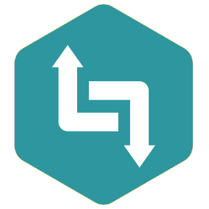

# <strong>MALI</strong> 

> Minimalistic Node.js gRPC microservice framework

- Promise / Async based flow control
- Simple and familiar Koa-like API
- Middleware support
- gRPC Metadata support

[GitHub](https://github.com/malijs/mali/)
[Get Started](#mali)
